<div align="center">

<picture>
  <source media="(prefers-color-scheme: dark)" srcset="docs/images/logo-dark.png">
  <source media="(prefers-color-scheme: light)" srcset="docs/images/logo-light.png">
  
</picture>

### A glassy, widget-rich dock that replaces the Windows taskbar.

Start, search, running apps, the system tray and live widgets, all in one floating dock.<br>
No admin rights. Your original taskbar always comes back.

[](#requirements)
[](https://dotnet.microsoft.com/)
[](#tech-stack)
[](https://github.com/sametgurtuna/DockHub/releases/latest)
[](https://github.com/sametgurtuna/DockHub/actions/workflows/ci.yml)

[**Download**](https://github.com/sametgurtuna/DockHub/releases/latest) &nbsp;·&nbsp;
[**Live demo**](https://sametgurtuna.github.io/dockhub-website/) &nbsp;·&nbsp;
[Features](#features) &nbsp;·&nbsp;
[Build from source](#build-from-source) &nbsp;·&nbsp;
[FAQ](#faq)

<br>

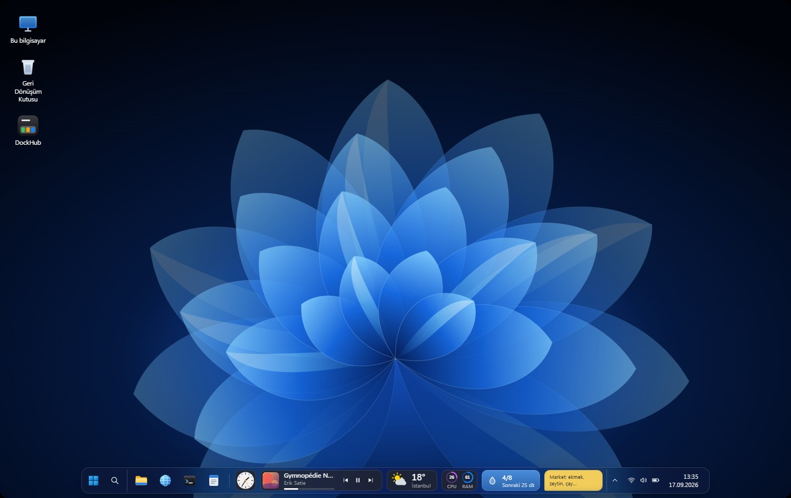

</div>

<br>

> [!NOTE]
> Every screenshot below is a real capture of DockHub running on Windows 11. To try it without installing, open the [interactive web demo](https://sametgurtuna.github.io/dockhub-website/).

## Contents

- [Highlights](#highlights)
- [Screenshots](#screenshots)
- [Installation](#installation)
- [Features](#features)
- [Widgets](#widgets)
- [How the taskbar replacement works](#how-the-taskbar-replacement-works)
- [Build from source](#build-from-source)
- [Command line](#command-line)
- [Configuration and data](#configuration-and-data)
- [Permissions and privacy](#permissions-and-privacy)
- [Project structure](#project-structure)
- [Writing a widget](#writing-a-widget)
- [Performance](#performance)
- [Known limitations](#known-limitations)
- [FAQ](#faq)
- [Contributing](#contributing)
- [License and credits](#license-and-credits)

## Highlights

- **Replaces the taskbar, keeps Windows intact.** The Start button opens the real Windows Start menu, and the Windows key, search, notification center and quick settings work exactly as before.
- **19 widgets, many layouts each.** Clocks, timers, reminders, sticky notes, now playing, audio, system monitors, AI usage and weather. Add the same widget as many times as you like; every copy keeps its own settings.
- **Live app buttons.** Hover for a real window thumbnail, right-click for a Jump List, watch badge counts and progress, and drag apps together into a folder.
- **Fluent to the core.** Blurred glass, Acrylic or solid backgrounds, light and dark themes, and your Windows accent color. Popups, folders and widgets animate with macOS-inspired genie, zoom and fan effects, all at your display's refresh rate.
- **Any edge, any shape.** Bottom, top, left or right; floating or attached; small, medium or large. On vertical docks, widgets collapse into compact tiles.
- **Safe by design.** No admin rights. When DockHub exits, crashes, or the session ends, the Windows taskbar and its tray icons come back.
- **Starts with Windows.** The installer enables autostart by default, and you can turn it off at any time.
- **Keyboard first.** Win+1…9 open and switch dock apps like on the Windows taskbar, and every DockHub action can get its own global shortcut.

## Screenshots

<table>
  <tr>
    <td width="50%">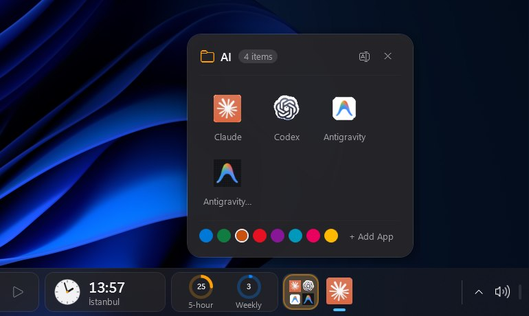<br><sub><b>Folders.</b> Drag items together, then click to fan them out. Rename and recolor from the popup.</sub></td>
    <td width="50%">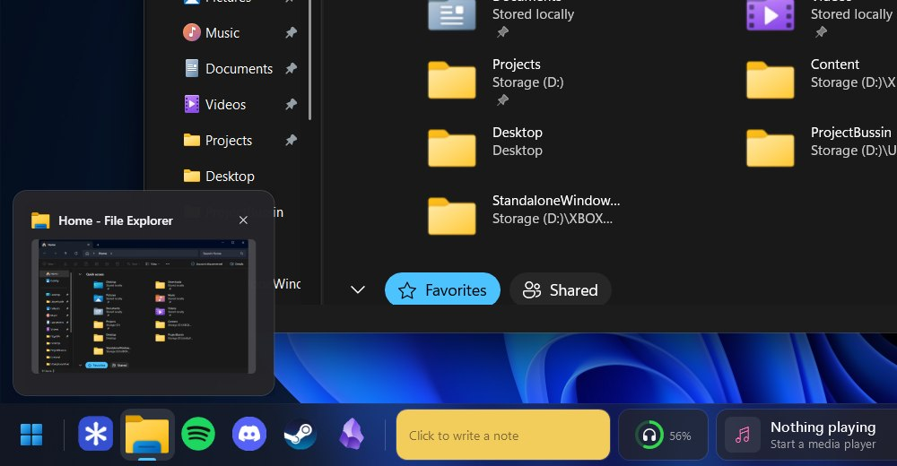<br><sub><b>Live window previews.</b> Hover a running app for a real thumbnail with a close button.</sub></td>
  </tr>
  <tr>
    <td width="50%">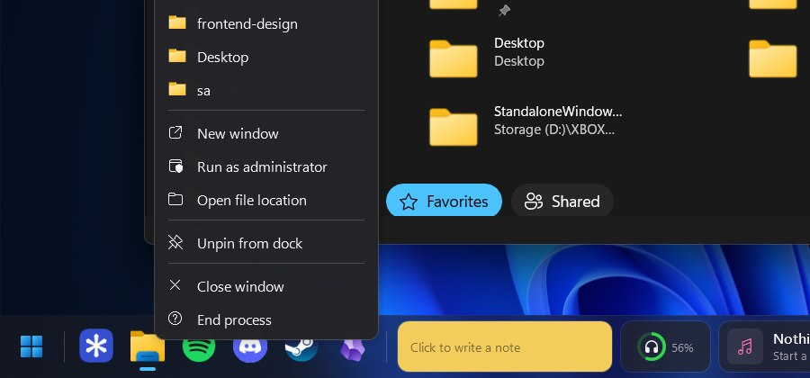<br><sub><b>Jump Lists.</b> Right-click an app for its recent items and tasks.</sub></td>
    <td width="50%">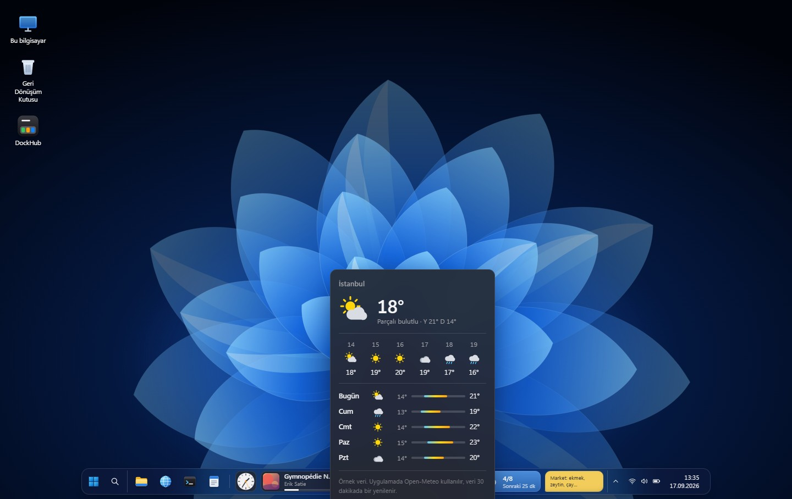<br><sub><b>Widget panels.</b> Click any widget for the full view.</sub></td>
  </tr>
  <tr>
    <td width="50%">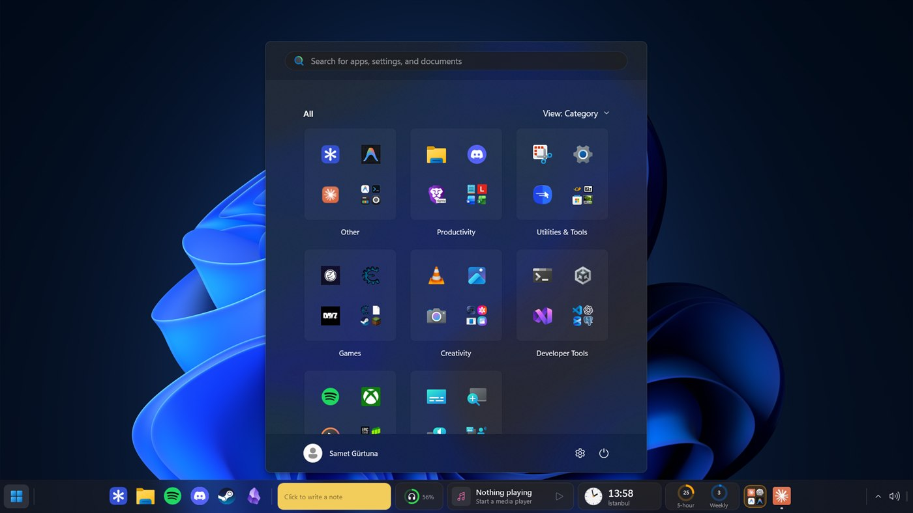<br><sub><b>Start menu.</b> The real Windows Start menu, opened from the dock.</sub></td>
    <td width="50%">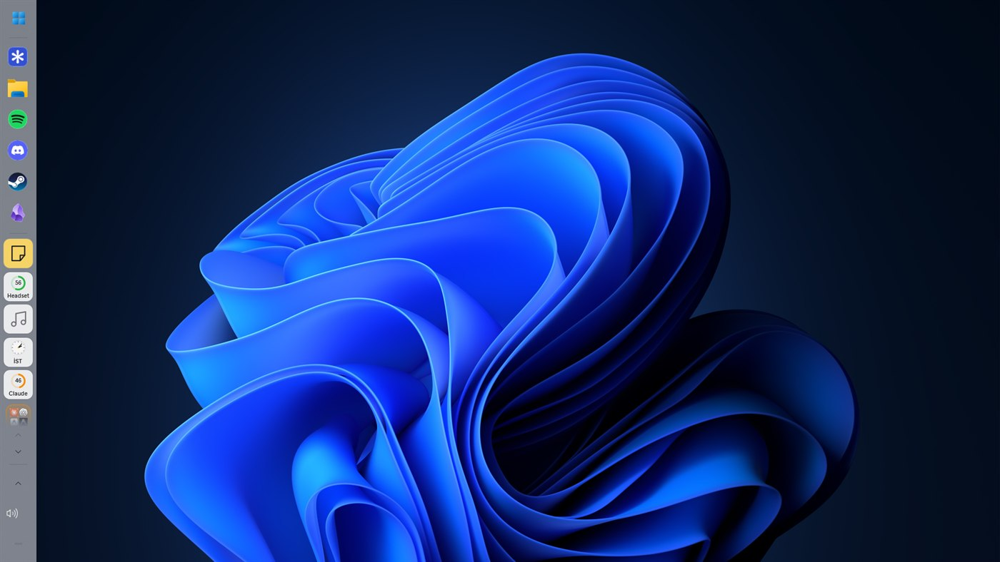<br><sub><b>Light theme, vertical dock.</b> Widgets become compact tiles.</sub></td>
  </tr>
  <tr>
    <td width="50%">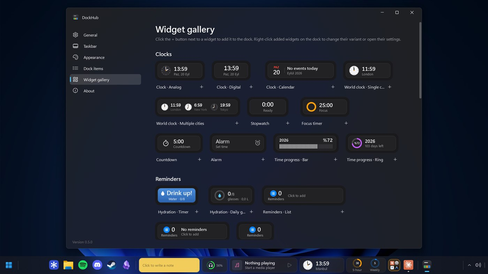<br><sub><b>Widget gallery.</b> Live previews; press + and the widget grows into the dock.</sub></td>
    <td width="50%">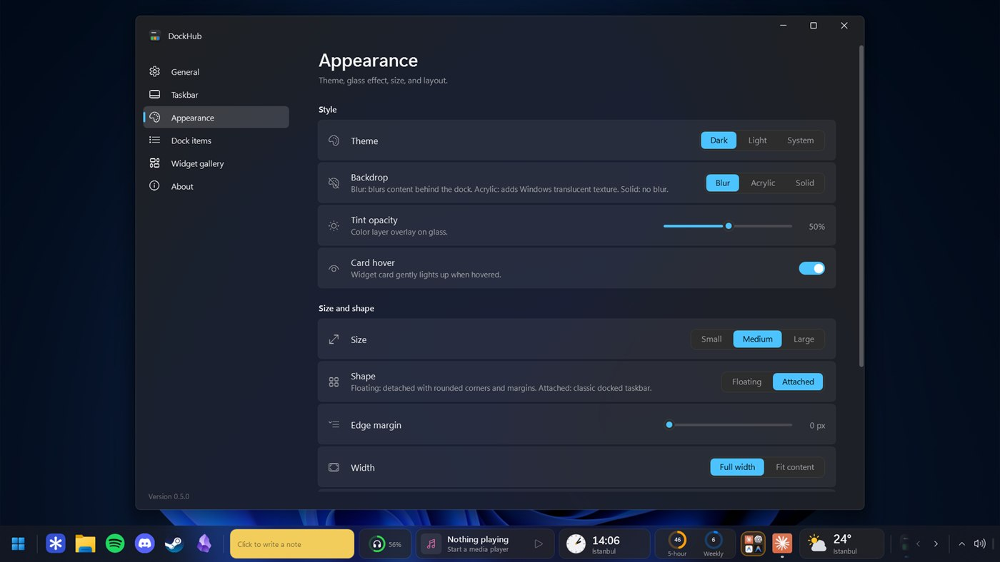<br><sub><b>Settings.</b> A Mica window for every option.</sub></td>
  </tr>
  <tr>
    <td width="50%">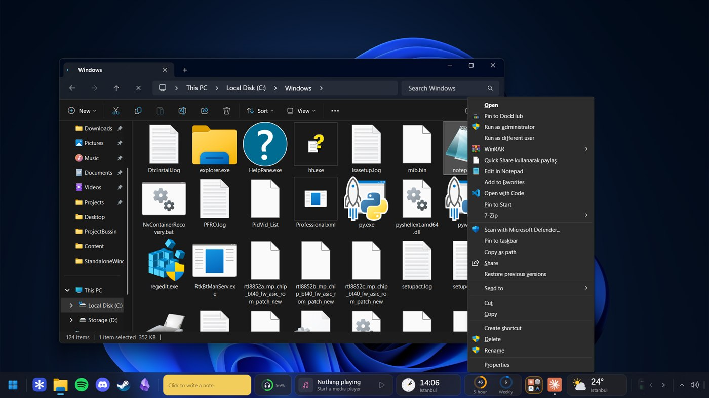<br><sub><b>Pin from File Explorer.</b> Right-click any .exe or shortcut.</sub></td>
    <td width="50%">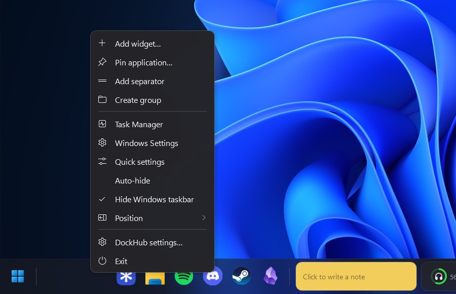<br><sub><b>Dock menu.</b> Right-click empty space for widgets, groups and position.</sub></td>
  </tr>
</table>

<p align="center">
  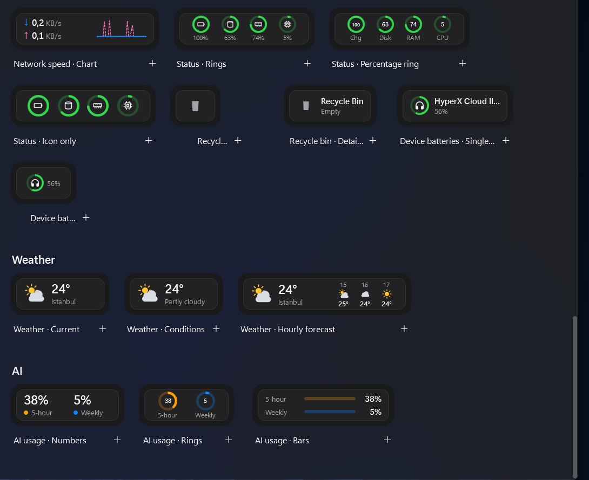
</p>

## Installation

### Installer (recommended)

1. Download **`DockHub-Setup-<version>-x64.exe`** from the [latest release](https://github.com/sametgurtuna/DockHub/releases/latest).
2. Run it. DockHub installs for the current user, so no administrator prompt appears.
3. Keep **"Start DockHub automatically when I sign in to Windows"** checked (the default) to have the dock ready every time Windows starts.

The installer is self-contained. It ships the .NET runtime, so there is nothing else to install. It is available in English and Turkish.

**Uninstalling** from *Settings › Apps* closes DockHub, restores the Windows taskbar, and removes the autostart entry and the File Explorer menu command. Your settings in `%AppData%\DockHub` are kept.

### Requirements

| | |
|---|---|
| Operating system | Windows 10 version 1809 (build 17763) or later, x64 |
| Recommended | Windows 11 22H2 or later (rounded corners, Mica settings window) |
| Runtime | Bundled with the installer. Running a framework-dependent build requires the [.NET 8 Desktop Runtime](https://dotnet.microsoft.com/download/dotnet/8.0). |

## Features

### Taskbar replacement

- **Start button** opens the Windows Start menu (`IImmersiveLauncher`); a second click closes it. Right-click opens the Win+X menu.
- **The Windows key** works as usual. Start, search, the notification center and quick settings open in Windows' own panels.
- **Search** and **Task View** buttons, each of which can be toggled.
- **Running apps**
  - Pinned apps are matched with their open windows, and windows of the same app are grouped into one button.
  - Other open apps are listed after a separator.
  - Active, attention-requesting and progress states (for example, download bars) are shown, along with taskbar-style badge counts.
  - Hovering a button shows a live thumbnail preview of its window(s), like the Windows taskbar.
  - Right-click shows the window list, the app's Jump List (recent files and tasks, when the app provides one), plus *Run as administrator*, *Open file location*, *Pin/Unpin* and *Close all windows*.
  - Clicking brings a window to the front, minimizes it, or cycles through the app's windows. Shift+click or middle-click opens a new window.
  - Pin a running app by dragging it into the dock or with the *Pin to DockHub* command.
  - **Pin from File Explorer:** right-click an `.exe` or shortcut and choose *Pin to DockHub*. On Windows 11 the command appears under *Show more options* (or Shift+right-click), because the new compact menu only lists commands from packaged apps.
  - **Groups (folders):** drag an app or widget onto another to create a folder. Folders can be renamed, given a custom accent color, and open with a staggered fan animation.
- **System tray.** App icons live in the dock and receive clicks, right-clicks and hover. Hidden icons sit in the overflow menu, and you choose which icons are always visible. Your Windows tray preferences are imported on first launch.
- **Network, volume and battery icons.** DockHub draws its own status icons next to the tray (Windows 11 keeps its real ones inside Explorer). Scroll the volume icon to change the volume, middle-click to mute, right-click to switch the output device; the battery icon only appears on devices with a battery.
- **Win+1…9 and Win+0** open, switch to or minimize the dock's first ten apps. Add Shift for a new window, Ctrl+Shift to run as administrator, Alt for the jump list. Hold Win to see the numbers on the dock.

  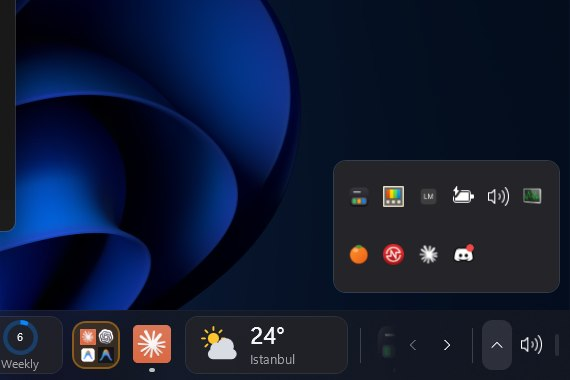
- **Clock.** Clicking it opens the notification center. Its context menu offers quick settings, date and time settings, and seconds and date options. A thin strip at the far end shows the desktop.
- **Reserved screen space.** An invisible AppBar reserves the dock's area, so maximized windows never slide under it.

### The dock

- **Look:** blurred glass, Acrylic or solid background with adjustable tint; dark, light or system theme; Windows accent color.
- **Size:** small (48 DIP, the same height as the Windows taskbar), medium (56 DIP) or large (66 DIP).
- **Shape:** *floating* (inset from the screen edges with rounded corners) or *attached* (a classic taskbar).
- **Width and alignment:** full width or fit to content; items centered or aligned to the start.
- **Position:** bottom, top, left or right. On vertical docks, widgets become compact tiles showing an icon or ring with a short value. Clicking a tile opens the full widget in a side panel, and timers, the water tracker and reminders run their main action directly.
- **Scrolling:** when items don't fit, the mouse wheel scrolls the dock smoothly, the edges fade, and arrow buttons appear.
- **Auto-hide:** the dock slides off the edge and returns when the pointer reaches it.
- **Hide in full screen:** the dock steps aside for games, videos and F11 mode.
- **Multi-monitor and DPI:** choose the monitor for the dock; per-monitor DPI (PerMonitorV2) is supported.
- **Drag and drop:** reorder apps, widgets and separators on the dock. Dropping an `.exe` or `.lnk` from File Explorer pins it.
- **Smooth motion:** scrolling, auto-hide and flyouts use frame-synchronized transitions at your display's refresh rate, including above 60 Hz. Hover highlights fade in, app icons grow slightly under the pointer, new items grow into place, and widget/folder popups open with macOS-style genie, zoom and shrink animations.
- **Accessibility:** *Settings › Appearance › Animations* reduces motion to short fades (or turns it off), following Windows' animation effects by default. Windows contrast themes are picked up automatically. Screen readers get names and states for every dock item, and *Move focus to the dock* (Win+Alt+T) lets you use the dock with the arrow keys, Enter, Shift+Enter (new window), the menu key and Esc.
- **Global shortcuts:** show the dock (Ctrl+Alt+D by default), open settings, pin an app, toggle auto-hide, mute or change the volume, all configurable in *Settings › General › Keyboard shortcuts*. Shortcuts another app already uses are flagged there.
- **Menus:** context menus and widget panels always open outside the dock, next to the pointer or the item.
- **Dock menu** (right-click an empty area): Add widget, Pin app, Add separator, Task Manager, Quick settings, Auto-hide, Hide Windows taskbar, Position, Settings, Exit.

## Widgets

Every widget can be added more than once, and each copy has its own settings. Change a widget's layout from its right-click **Layout** menu or in *Settings › Dock items*.

| Category | Widget | Layouts | Notes |
|---|---|---|---|
| Clocks | **Clock** | Analog, Digital, Calendar | 12 or 24 hour format, seconds, date format. The calendar layout shows your next reminder. |
| | **World clock** | Single city, Multiple cities | Add and reorder cities; day and night dial. |
| | **Stopwatch** | Single | Click to start or pause, right-click to reset. |
| | **Focus timer** | Single | Pomodoro with focus and break lengths and a notification at the end. |
| | **Countdown** | Single | Presets, a label, and a notification at the end. |
| | **Alarm** | Single | Time, label, repeat daily. The alarm notification plays a sound and stays until dismissed. |
| | **Time progress** | Bar, Ring | How much of the day, week, month or year has passed. |
| Reminders | **Hydration** | Timer, Daily goal | Click to add a glass. Interval notifications include an "I drank" button. |
| | **Reminders** | List, Next, Count | Toast notifications with a "Snooze 10 min" action. |
| Notes | **Sticky note** | Single | A preview lives in the dock; clicking opens a large paper in six colors with adjustable text size. Saves automatically. |
| Media | **Now playing** | Full, Compact, Mini | Windows media controls (SMTC): Spotify, browsers, VLC and more. Cover art, progress, previous, play and next. |
| | **Audio device** | Compact, Slider | Switch between output devices, scroll to adjust volume, click to mute. |
| System | **CPU and memory** | Numbers, Rings, Bars | Refresh interval from 1 to 10 seconds. |
| | **Network** | Numbers only, With graph | Live download and upload speed. |
| | **Status** | Rings, Percentage ring, Icons only | Battery, disk, memory and processor. |
| | **Recycle bin** | Icon only, Detailed | Drag files onto it to delete them, click to open, right-click to empty. |
| | **Device batteries** | Single device, Multiple devices | Battery levels for Bluetooth and USB peripherals (wireless headsets, mice, keyboards). |
| AI | **AI usage** | Numbers, Rings, Bars | Claude Code 5-hour and weekly usage limits, refreshed in the background every 5 minutes. |
| Weather | **Weather** | Current, Condition, Hourly forecast | [Open-Meteo](https://open-meteo.com/), no API key needed. Uses a city or your Windows location. |

To add a widget, press **+** next to its preview in *Settings › Widget gallery*, or right-click an empty area of the dock and choose **Add widget**. Right-clicking a widget on the dock gives it its own actions, layouts and settings.

<p align="center">
  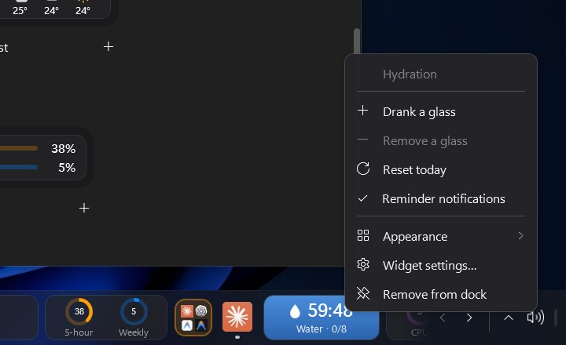
</p>

## How the taskbar replacement works

**No administrator rights are needed.** DockHub runs `asInvoker`. Running it elevated is not recommended, because File Explorer cannot drag and drop into an elevated window (UIPI). Explorer is never closed; DockHub runs alongside it.

With *Settings › General › Replace the taskbar* set to **DockHub** (the default):

1. ManagedShell's task service tracks open windows, and its tray service takes over `Shell_TrayWnd` notifications so apps register their tray icons with the dock.
2. Explorer's "taskman" window is handed back, so the **Windows key** keeps opening Start.
3. The Windows taskbar state (`ABM_GETSTATE`) is written to `%AppData%\DockHub\session.json`. The taskbar is then switched to auto-hide and the `Shell_TrayWnd` / `Shell_SecondaryTrayWnd` windows are hidden.
4. A lightweight watcher running every 250 ms hides the Explorer taskbar again if it reappears on its own. It stays out of the way while Start, search or a shell menu is open.
5. An invisible, click-through AppBar reserves the dock's thickness at the screen edge.

In **Both** mode, the Windows taskbar is left untouched and the tray is not taken over; the dock sits above the taskbar. Switching modes restarts the app.

<p align="center">
  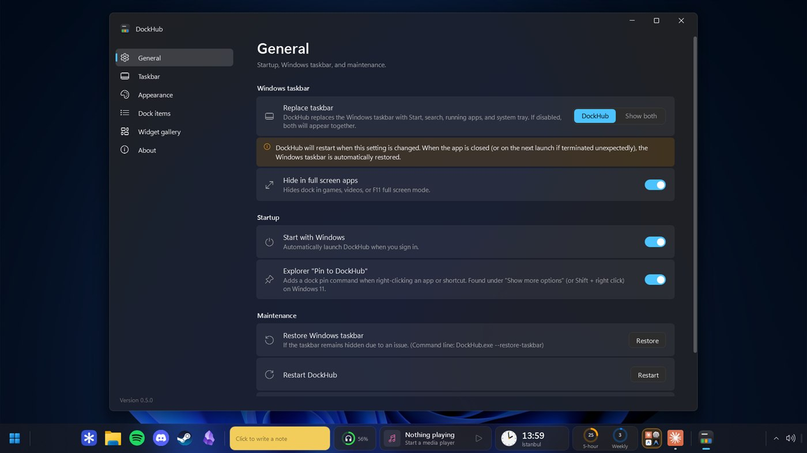
</p>

### The Windows taskbar always comes back

The taskbar is restored automatically when:

- the mode is switched to **Both**,
- DockHub exits normally (dock menu, tray menu, `--exit`),
- the Windows session ends (`SessionEnding`),
- an unhandled error occurs (`UnhandledException` / `ProcessExit`),
- DockHub is uninstalled.

If DockHub is killed (Task Manager, power loss), the taskbar stays in auto-hide mode and still appears when the pointer reaches the bottom edge. On the next launch, or with `--restore-taskbar`, `session.json` is read and the original state is restored. A `TaskbarCreated` broadcast makes apps register their tray icons with Explorer again.

**In an emergency**, use any of these:

```powershell
DockHub.exe --restore-taskbar
```

- *Settings › General › Restore the Windows taskbar*
- Tray menu › *Restore taskbar*
- Last resort: restart `explorer.exe` and turn off *Settings › Personalization › Taskbar › Automatically hide the taskbar* in Windows.

> [!IMPORTANT]
> Windows 11's network, volume and battery icons live inside Explorer, so the dock shows its own equivalents. Reach the quick settings panel by right-clicking the clock or the dock, or with Win+A. Do not run other taskbar replacements (StartAllBack, ExplorerPatcher, RetroBar and similar) at the same time.

## Build from source

### Prerequisites

- Windows 10 1809 or later
- [.NET 8 SDK](https://dotnet.microsoft.com/download) or newer (.NET 9 and 10 SDKs also build the `net8.0` target)
- Optional: [Inno Setup 6](https://jrsoftware.org/isinfo.php) to build the installer (`winget install JRSoftware.InnoSetup`)

NuGet dependencies are restored automatically:

- [`ManagedShell`](https://www.nuget.org/packages/ManagedShell) 0.0.372: task list, system tray, AppBar and full screen detection (Apache-2.0)
- [`Microsoft.Toolkit.Uwp.Notifications`](https://www.nuget.org/packages/Microsoft.Toolkit.Uwp.Notifications) 7.1.3: toast notifications (MIT)

### Build and run

```powershell
git clone https://github.com/sametgurtuna/DockHub.git
cd DockHub
dotnet build CustomDock.sln -c Release
dotnet run --project src/CustomDock -c Release
```

You can also open `CustomDock.sln` in Visual Studio 2022 and press F5.

### Running tests

```powershell
dotnet test CustomDock.sln
```

The unit tests (`tests/CustomDock.Tests`) cover config loading and migration, dock item operations, app matching and pin repair, and parsing. They use a throwaway `DOCKHUB_HOME`, so your own settings are never touched. GitHub Actions runs the build and tests on every push, and a `v*` tag builds the installer into a draft release.

### Portable folder

```powershell
dotnet publish src/CustomDock -c Release -r win-x64 --self-contained false -o publish
```

`publish\DockHub.exe` runs as is. Use `--self-contained true` to bundle the .NET runtime.

### Installer

```powershell
pwsh installer/build.ps1
```

The script publishes a self-contained ReadyToRun build to `artifacts/publish/win-x64` and compiles [`installer/DockHub.iss`](installer/DockHub.iss) into `installer/Output/DockHub-Setup-<version>-x64.exe`. The version comes from `src/CustomDock/CustomDock.csproj`.

What the installer does:

| | |
|---|---|
| Install scope | Per user under `%LocalAppData%\Programs\DockHub` (admin install is available from the dialog) |
| Autostart | `HKCU\...\Run\DockHub` = `"...\DockHub.exe" --startup`, enabled by default |
| Upgrades | Closes the running dock with `--exit` before replacing files |
| Uninstall | Runs `--exit` and `--restore-taskbar`, then removes the autostart entry and the File Explorer verbs |
| Languages | English, Turkish |

## Command line

| Command | Description |
|---|---|
| `DockHub.exe` | Starts the dock. If it is already running, brings the settings window to the front. |
| `DockHub.exe --exit` | Closes the running instance cleanly (the taskbar comes back). |
| `DockHub.exe --pin "<file>"` | Pins an app to the dock (used by the File Explorer command). Starts the dock if needed. |
| `DockHub.exe --restore-taskbar` | **Emergency:** restores the Windows taskbar under any circumstances. |
| `DockHub.exe --startup` | Used by the autostart entry. |

The `DOCKHUB_HOME` environment variable changes the settings and data folder, which is useful for portable use or testing, for example `set DOCKHUB_HOME=D:\DockTest`.

## Configuration and data

| File | Contents |
|---|---|
| `%AppData%\DockHub\config.json` | All settings and dock items (order, layout, per-item settings) |
| `%AppData%\DockHub\data\notes-<item>.json` | Text of each sticky note |
| `%AppData%\DockHub\data\reminders.json` | Pending reminders |
| `%AppData%\DockHub\data\hydration.json` | Daily water counter |
| `%AppData%\DockHub\data\weather-cache.json` | Latest weather per location, for an instant first paint |
| `%AppData%\DockHub\data\trash\` | Data of removed widgets (for example sticky notes), kept for 7 days |
| `%AppData%\DockHub\session.json` | Taskbar restore information (exists only while the taskbar is hidden) |
| `%AppData%\DockHub\pin-requests.txt` | Pending pin requests from File Explorer (temporary) |
| `%AppData%\DockHub\log.txt` | Log file (rotates at 512 KB) |
| `%AppData%\DockHub\backups\` | A copy of `config.json` from each of the last 7 days, plus the state saved before an import |

- Files are written to a temporary file first and then moved into place, so an interrupted write never corrupts them.
- A corrupt `config.json` is backed up as `config.json.corrupt-<date>` and DockHub loads the newest daily backup (and tells you); only without one does it start with defaults.
- *Settings › General › Backup and restore* exports everything (dock, widgets, notes, reminders) to a `.zip` and imports it again.
- Removing items, deleting folders and applying a layout preset can be undone for a few seconds from the toast next to the dock, from the dock's right-click menu, or with Ctrl+Z in Settings.
- Settings from the project's previous name (`%AppData%\CustomDock`, `CUSTOMDOCK_HOME`) are migrated automatically on first launch.
- Version 1 `config.json` files are upgraded to version 2 automatically.

<details>
<summary>Example <code>config.json</code> (shortened)</summary>

```json
{
  "version": 2,
  "taskbarMode": "Replace",
  "hideOnFullscreen": true,
  "startWithWindows": true,
  "showStartButton": true,
  "showSearchButton": true,
  "showRunningApps": true,
  "showTray": true,
  "pinnedTrayIcons": ["c:\\program files\\spotify\\spotify.exe"],
  "edge": "Bottom",
  "autoHide": false,
  "theme": "Dark",
  "backdrop": "Blur",
  "tintOpacity": 0.35,
  "size": "Small",
  "layout": "Floating",
  "widthMode": "Full",
  "alignment": "Center",
  "edgeMargin": 6,
  "items": [
    { "id": "e0e4424de2", "kind": "App", "path": "C:\\WINDOWS\\explorer.exe" },
    { "id": "d09f6ec024", "kind": "Separator" },
    { "id": "521927ad3f", "kind": "Widget", "widget": "clock", "variant": "analog",
      "settings": { "use24Hour": true, "showSeconds": false, "dateFormat": "Short" } },
    { "id": "2f50f40ec4", "kind": "Widget", "widget": "weather", "variant": "hourly",
      "settings": { "locationMode": "City", "cityName": "Istanbul", "latitude": 41.0138, "longitude": 28.9497 } }
  ]
}
```

An app item's `path` can be an `.exe`, an `.lnk` shortcut, any file, or a Store or PWA app in the form `shell:AppsFolder\<AUMID>` (*Settings › Dock items › Add app* lists these).

</details>

## Permissions and privacy

- **File Explorer command.** *Pin to DockHub* is registered under `HKCU\Software\Classes\exefile\shell` and `lnkfile\shell`. No admin rights are needed, turning the setting off removes the keys, and the path is updated if the app moves.
- **Autostart.** `HKCU\Software\Microsoft\Windows\CurrentVersion\Run\DockHub`, toggled from *Settings › General*.
- **Location** (weather set to *Automatic*). Both location services and *Let desktop apps access your location* must be on in *Windows Settings › Privacy & security › Location*. Otherwise the widget asks for a city.
- **Notifications.** No extra permission. The app registers its AUMID under HKCU on first use. With *Do not disturb* on, notifications collect in the notification center; if a toast cannot be shown, a tray balloon is used instead.
- **Media (SMTC).** No permission or account. The player only needs to support Windows media controls.
- **Network.** DockHub itself only contacts `api.open-meteo.com` (weather), `geocoding-api.open-meteo.com` (city search) and, once a day unless you turn it off, `api.github.com` to look for a newer release. The *AI usage* widget, if you add it, runs your locally installed Claude CLI (`claude -p /usage`) at the interval you choose, and that CLI talks to Anthropic with your own login. There is no telemetry.

## Project structure

```text
CustomDock.sln
installer/
├── DockHub.iss              Inno Setup script (per-user install, autostart, clean uninstall)
└── build.ps1                Publishes the app and compiles the installer
src/CustomDock/              Produces DockHub.exe
├── App.xaml(.cs)            Entry point: single instance, --exit / --restore-taskbar, crash safety, shell and dock setup
├── app.manifest             PerMonitorV2 DPI, asInvoker
├── Assets/DockHub.ico       App and tray icon (generated by tools/generate-icon.ps1)
├── Core/                    AppConfig (v2 item model), ConfigService (v1 to v2 migration), JSON storage, theme, log
├── Native/                  P/Invoke, DWM and glass effects, monitors, high resolution shell icons
├── Shell/                   ManagedShell integration
│   ├── ShellHost.cs           Tasks, tray, Start, search and notification center commands
│   ├── TaskbarController.cs   Hiding and restoring the Windows taskbar, crash recovery
│   ├── StartMenuLauncher.cs   Start menu through IImmersiveLauncher
│   ├── RunningAppsService.cs  Grouping windows by app
│   ├── JumpListService.cs     Reads an app's Jump List (recent/pinned tasks) for the right-click menu
│   └── AppKeys.cs, TrayPreferences.cs, DefaultItems.cs
├── Services/                Clock, system and network monitors, media (SMTC), weather (with WeatherHub cache),
│                            notifications, reminders, hydration, app launcher
├── Dock/                    DockWindow (zones, scrolling, drag and drop, position, auto-hide), AppButton,
│                            WidgetItemView (card, vertical tile and panel), GroupItemView (folders),
│                            WindowPreviewWindow (live thumbnails), GenieEffectHelper, PopupAnimationHelper,
│                            TrayIconView, SpaceReserver, EdgeTriggerWindow, TrayIconManager
├── Controls/                WidgetCard, DockZonesPanel, RingGauge, AnalogClock, WeatherIcon, TickBar, Sparkline,
│                            Glyphs, SettingRow
├── Settings/                Settings window (Mica), widget gallery, app picker, widget settings templates
├── Themes/                  Dark.xaml, Light.xaml (colors), Controls.xaml (styles)
└── Widgets/                 WidgetBase, WidgetRegistry, CompactTile and one folder per widget
    ├── Clock/  WorldClock/  Timers/ (stopwatch, focus, countdown, alarm)  TimeProgress/
    ├── Hydration/  Reminders/  Notes/  Media/  Audio/
    ├── System/ (CPU and memory, network, status)  RecycleBin/  BatteryDevices/
    └── AI/ (AI usage)  Weather/
tools/generate-icon.ps1      Renders Assets/DockHub.ico
docs/images/                 README artwork
```

## Writing a widget

1. Add `Widgets/Sample/SampleWidget.xaml`. The root element must be `w:WidgetBase`. Use elements named `Layout_<variant>` for different layouts:

   ```xml
   <w:WidgetBase x:Class="CustomDock.Widgets.SampleWidget"
                 xmlns="http://schemas.microsoft.com/winfx/2006/xaml/presentation"
                 xmlns:x="http://schemas.microsoft.com/winfx/2006/xaml"
                 xmlns:w="clr-namespace:CustomDock.Widgets">
       <Grid>
           <TextBlock x:Name="Layout_big" Style="{StaticResource ValueText}" VerticalAlignment="Center" />
           <TextBlock x:Name="Layout_small" Style="{StaticResource TitleText}" VerticalAlignment="Center" />
       </Grid>
   </w:WidgetBase>
   ```

2. Implement the lifecycle in code-behind. Subscribe to services in `OnAttached`, unsubscribe in `OnDetached`, and fill in `UpdateCompact` for vertical docks:

   ```csharp
   public sealed class SampleSettings : ObservableObject
   {
       private string _text = "Hello";
       public string Text { get => _text; set => Set(ref _text, value); }
   }

   public partial class SampleWidget : WidgetBase
   {
       private SampleSettings _settings = new();

       public SampleWidget() => InitializeComponent();

       protected override void OnAttached()
       {
           _settings = GetSettings<SampleSettings>();     // per-item settings in config.json, saved on change
           _settings.PropertyChanged += (_, _) => Render();
           AppServices.Clock.MinuteTick += OnTick;       // shared, aligned timer
       }

       protected override void OnDetached() => AppServices.Clock.MinuteTick -= OnTick;

       protected override void OnVariantChanged()        // on first attach and whenever the layout changes
       {
           ShowLayout(Layout_big, Layout_small);
           Render();
       }

       private void OnTick(object? s, DateTime now) => Render();

       private void Render()
       {
           Layout_big.Text = Layout_small.Text = _settings.Text;
           RefreshCompact();                             // keep the vertical tile in sync
       }

       protected override void UpdateCompact(CompactTile tile)
       {
           tile.ShowGlyph(Descriptor.Icon, Descriptor.AccentKey);
           tile.Text = _settings.Text[..Math.Min(4, _settings.Text.Length)];
       }
   }
   ```

3. Register the widget in `Widgets/WidgetRegistry.cs`:

   ```csharp
   new()
   {
       Id = "sample", Name = "Sample", Category = WidgetCategories.Notes, Description = "...",
       IconPath = "M4,4 H20 V20 H4 Z", AccentKey = "AccentGreenBrush",
       Variants = new[] { new WidgetVariant("big", "Big"), new WidgetVariant("small", "Small") },
       Factory = () => new SampleWidget(), SettingsType = typeof(SampleSettings),
   },
   ```

4. Optionally, add a `DataTemplate` with `DataType="{x:Type w:SampleSettings}"` to `Settings/WidgetSettingsTemplates.xaml` for its settings UI. For richer UIs, return a `UserControl` from `SettingsViewFactory` (see `WeatherSettingsView`).

The widget then shows up in the gallery automatically. Other helpers:

- **Popups:** `OpenPopup(popup)` opens a popup on the correct side of the dock, pauses auto-hide while it is open, and aligns to the tile on vertical docks.
- **Hiding:** a widget that sets its own `Visibility` to `Collapsed` is removed from the dock as well.
- **Tile clicks:** if `OnCompactClick` returns `true`, clicking the tile on a vertical dock runs that action instead of opening the panel.

## Performance

- **Timers.** Clock-based widgets share a single timer aligned to seconds or minutes. It ticks once a minute when no widget needs seconds and stops when nothing is subscribed. No timer runs more often than once per second, except the taskbar watcher (250 ms, a single Win32 call) and the Start menu visibility poll (200 ms).
- **Monitoring.** System monitoring uses `GetSystemTimes` and `GlobalMemoryStatusEx`; disk usage is sampled once a minute. Network measurement runs only while a network widget is on the dock.
- **Event driven.** The window list and full screen detection update through ManagedShell's shell hooks. Media updates through SMTC events, and the progress bar ticks once per second only while playing.
- **Weather.** Widgets that share a location share one request and cache. Data refreshes every 30 minutes and retries after 3 minutes on failure.
- **Scrolling.** The scroll animation runs only while scrolling.

## Known limitations

- **Window effects.** The blurred glass effect uses `SetWindowCompositionAttribute`, so it works even when the window is inactive. Corner rounding comes from DWM (about 8 px); corners stay square on Windows 10.
- **Shell integration.** Windows 11's XAML tray items (network, volume and battery quick settings, language bar) belong to Explorer, so the dock shows its own network, volume and battery icons and opens Windows' quick settings panel from them. The per-app taskbar progress indicator may not appear for some apps, because the Windows key stays with Explorer.
- **Multiple monitors.** The main dock (with widgets and tray icons) lives on one display; with *Show on all displays* the other displays get a dock with apps. The Windows taskbar is hidden on every display.
- **Language.** The interface is available in English and Turkish (*Settings › General › Language*; System follows your Windows display language). Dates and numbers follow your Windows locale. Text that has no translation yet appears in English.

## FAQ

<details>
<summary><b>What happens to my Windows taskbar?</b></summary>

In the default mode it is hidden and switched to auto-hide; Explorer keeps running. It returns when DockHub exits, crashes, is uninstalled, or when the session ends. In *Both* mode the taskbar is never touched.
</details>

<details>
<summary><b>Does DockHub start with Windows?</b></summary>

Yes. The installer enables it by default. You can turn it off during setup or later in *Settings › General*.
</details>

<details>
<summary><b>Does it need administrator rights?</b></summary>

No. DockHub installs and runs as a normal user.
</details>

<details>
<summary><b>Does it send any data?</b></summary>

Only weather and city search requests to Open-Meteo. If you add the AI usage widget, your local Claude CLI checks your usage with your own account. There is no DockHub account and no telemetry.
</details>

<details>
<summary><b>An app doesn't show up on the dock, or its icon is missing. What can I do?</b></summary>

Open *Settings › About › Copy diagnostics* and paste the result into an issue. It lists every window DockHub knows about, why it is or isn't shown, and whether each pinned app's icon and path were found. From a terminal, `plans/tools/window-diag.ps1 -ProcessName <name>` shows the same window details for one app. Setting `"debugLogging": true` in `config.json` (or `DOCKHUB_DEBUG=1`) writes extra detail to `log.txt`.

Pins of apps that update themselves into versioned folders (Discord, Slack, Microsoft Store apps) are repaired automatically on start.
</details>

<details>
<summary><b>Can I use it with StartAllBack or ExplorerPatcher?</b></summary>

No. Taskbar replacements should not run at the same time.
</details>

## Contributing

Bug reports, widget ideas and pull requests are welcome. Please open an [issue](https://github.com/sametgurtuna/DockHub/issues) first for larger changes so the approach can be discussed. When filing a bug, attach `%AppData%\DockHub\log.txt` if possible.

## License and credits

This repository does not include a license file yet. Until one is added, all rights are reserved by the author.

DockHub builds on excellent open source work:

- [ManagedShell](https://github.com/cairoshell/ManagedShell) (Apache-2.0)
- The Start menu (`IImmersiveLauncher`), tray icon mouse forwarding and "show desktop" techniques are adapted from [RetroBar](https://github.com/dremin/RetroBar) (Apache-2.0)
- [Microsoft.Toolkit.Uwp.Notifications](https://github.com/CommunityToolkit/WindowsCommunityToolkit) (MIT)
- Weather data by [Open-Meteo](https://open-meteo.com/) (CC BY 4.0)

Windows is a trademark of Microsoft Corporation. DockHub is not affiliated with Microsoft.
